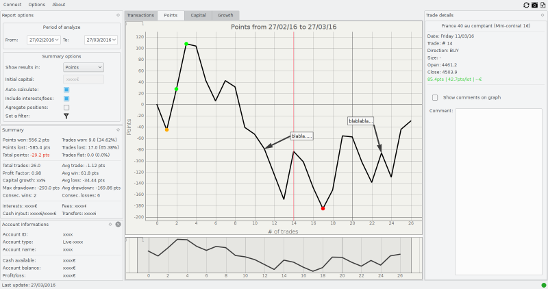
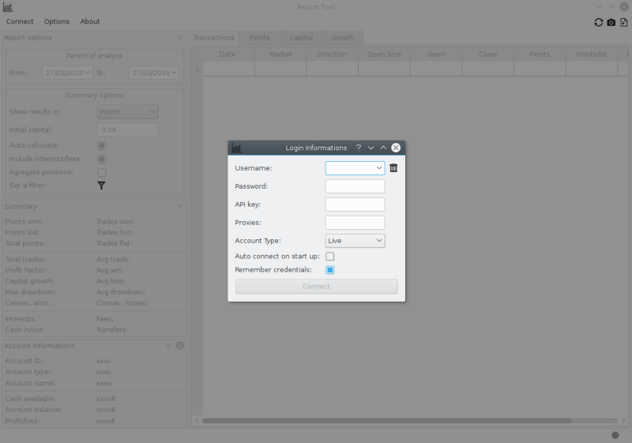

# Report Tool

Report Tool is an application coded in Python 3.8 / PyQt5 using IG Rest API to show basics statistics about past trades.

## Features

* Listing of past trades,
* Summary in points, points per lot, currency or percentage
* Equity curves,
* Export of trades in .txt format or .jpeg format
* Trades comment,
* Market filter.



## Installation

### What you will need

* Python 3.8: https://www.python.org/downloads/
* pip (should already be installed with Python): https://pip.pypa.io/en/stable/installing/
* pipenv: `pip install pip --upgrade ; pip install pipenv`

### Dependencies

```shell script
cd Report-Tool
pipenv run python main.py
```

## Usage

* Download the archive and unzip it:
```shell script
cd Report-Tool
pipenv run python main.py
```
* Enter your credentials, via the menu "Connect"



* Have fun !

## Disclaimer

This tool was originally created by user **beniSo** but he's no longer on GitHub.
